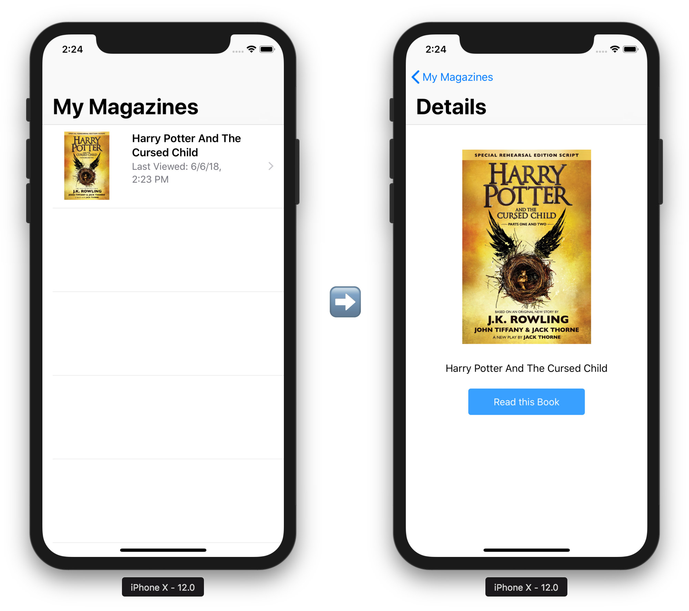

# iOS 12 Siri Shortcuts

An example of using Siri Shortcuts as part of the Intents framework in iOS 12 and later. It handles 
both `NSActivity` and `Intents` use-cases by implementing a sample "Magazine Viewer".

As of for now, this example is still under active development and lives from the activity of the community.
Enhance it by contributing more improvements to it!

## License

MIT

## Author

Hans Knöchel
